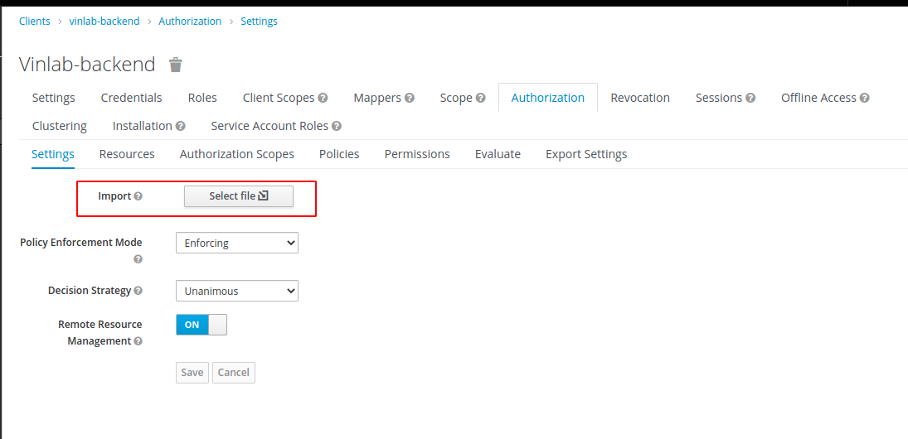

# VinDr Lab Deployment

Welcome to the VinDr Lab project.

# :wrench: System Properties

Our project requires at least 4GB of RAM system for the best performance and experiement.

# :rocket: Start it up

There are two ways to deploy our project are:

**Option 1: Kubernetes**

**Option 2: Docker**

and the instruction is going to be described below. But we think using Kubernetes will be more interesting.

# :ship: Kubernetes

## Prerequisites

We use k3s as Kubernetes supporter. Install the <a href="https://k3s.io/">k3s</a> at first.

## Run

- First, you must initialize the namespace for these deployments by running: `kubectl create namespace vinlab`

- Then, go in to the `kubernetes` folder and create the config map: `sh ./create_config_map.sh`

- Next step, just run `kubectl apply -f . -n vinlab`

- As you can see, in the first commits, we use `ingress-nginx` to load-balance and route endpoints. However, we found out that was inconvenient. So remove it and try another simple solution, a load-balancer service.

## Check

To make sure everything is fine, please run `kubectl -n vinlab get pod` and `kubectl -n vinlab get svc`

```
NAME                                           READY   STATUS    RESTARTS   AGE
svclb-vinlab-lb-h5tn2                          1/1     Running   0          2m8s
vinlab-uploader-deployment-785449b44f-wl8wq    1/1     Running   0          2m7s
es-deployment-779db4985d-tqzn2                 1/1     Running   0          2m8s
keycloak-deployment-6dc647c6cc-9fpxq           1/1     Running   0          2m8s
apigateway-deployment-d6dcc5d8f-qvb8l          1/1     Running   0          2m8s
redis-deployment-756b4b8956-48lpp              1/1     Running   0          2m8s
orthanc-deployment-fb799595-kl8vw              1/1     Running   0          2m8s
minio-deployment-556459976d-fb6g2              1/1     Running   0          2m8s
vinlab-viewer-deployment-59cfd85f6b-mgj6t      1/1     Running   0          2m7s
id-generator-deployment-7454b7bf6d-m2pv9       2/2     Running   0          2m8s
vinlab-api-deployment-d4fbc5c5f-pctbr          1/1     Running   3          2m8s
vinlab-dashboard-deployment-64f679d7b8-b7cqt   1/1     Running   0          2m7s
```

```
NAME              TYPE           CLUSTER-IP      EXTERNAL-IP     PORT(S)          AGE
nginx             ClusterIP      10.43.226.118   <none>          80/TCP           4m39s
dashboard         ClusterIP      10.43.83.174    <none>          80/TCP           4m39s
es                ClusterIP      10.43.27.208    <none>          9200/TCP         4m39s
id-generator      ClusterIP      10.43.103.96    <none>          8080/TCP         4m39s
keycloak          ClusterIP      10.43.220.30    <none>          8080/TCP         4m39s
minio             ClusterIP      10.43.2.239     <none>          9000/TCP         4m39s
orthanc           ClusterIP      10.43.23.53     <none>          8042/TCP         4m39s
redis             ClusterIP      10.43.71.155    <none>          6379/TCP         4m39s
viewer            ClusterIP      10.43.242.203   <none>          80/TCP           4m39s
vinlab-api        ClusterIP      10.43.66.181    <none>          8080/TCP         4m39s
vinlab-uploader   ClusterIP      10.43.61.64     <none>          8080/TCP         4m39s
vinlab-lb         LoadBalancer   10.43.150.40    192.168.1.2     8080:31579/TCP   4m39s
```

# :whale2: Docker

## Prerequisites

To deploy using Docker, yes, install `docker` and `docker-compose` first

## Run

We've already made it as simple as we can. Just go to the docker directory then run: `./run.sh` file and double check by `docker ps -a`

## Check

```
CONTAINER ID   IMAGE                                                 COMMAND                  CREATED              STATUS              PORTS                                              NAMES
153009b8a67a   vindr/vinlab-viewer                                   "docker-entrypoint.s…"   59 seconds ago       Up 57 seconds       443/tcp, 0.0.0.0:50075->80/tcp                     vinlab-viewer
3b125d42a158   vindr/vinlab-dashboard                                "docker-entrypoint.s…"   59 seconds ago       Up 55 seconds       0.0.0.0:50076->80/tcp                              vinlab-dashboard
2fa93511c79a   vindr/vinlab-dicom-uploader                           "./run.sh"               59 seconds ago       Up 56 seconds       0.0.0.0:50074->8080/tcp                            vinlab-uploader
91b58129b11a   vindr/vinlab-api                                      "./bin"                  About a minute ago   Up 46 seconds       0.0.0.0:50081->8080/tcp                            vinlab-api
834ec27d02aa   vindr/vinlab-idgen                                    "./bin"                  About a minute ago   Up About a minute   0.0.0.0:50072->8080/tcp                            vinlab-idgen
446fd95f1dc5   nginx:latest                                          "/docker-entrypoint.…"   About a minute ago   Up 54 seconds       80/tcp, 0.0.0.0:8080->8080/tcp                     vinlab-nginx
1163d0f96615   osimis/orthanc                                        "/docker-entrypoint.…"   About a minute ago   Up About a minute   0.0.0.0:50071->4242/tcp, 0.0.0.0:50070->8042/tcp   vinlab-orthanc
06529c0e2267   jboss/keycloak:11.0.2                                 "/opt/jboss/tools/do…"   About a minute ago   Up About a minute   8080/tcp, 8443/tcp, 0.0.0.0:50064->9090/tcp        vinlab-keycloak
09c3634789a0   rqlite/rqlite:5.10.2                                  "docker-entrypoint.s…"   About a minute ago   Up About a minute   0.0.0.0:50069->4001/tcp, 0.0.0.0:50068->4002/tcp   vinlab-rqlite
78533dc42a78   docker.elastic.co/elasticsearch/elasticsearch:7.9.2   "/tini -- /usr/local…"   About a minute ago   Up About a minute   9300/tcp, 0.0.0.0:50067->9200/tcp                  vinlab-es
5079b39c21d5   redis:latest                                          "docker-entrypoint.s…"   About a minute ago   Up About a minute   0.0.0.0:50065->6379/tcp                            vinlab-redis
5494a30718a4   minio/minio                                           "/usr/bin/docker-ent…"   About a minute ago   Up About a minute   0.0.0.0:50066->9000/tcp                            vinlab-minio
```

# :paperclip: Relevants

## Keycloak

We use Keycloak as an user management system (users, roles, permissions...), please follow [this link](KEYCLOAK.md) to complete the installation But to make it smoother, you now can import through some assets which we provided under the `keycloak_assets` folder.

First, create a new `realm` by:


Select `vindr-lab-realm-export.json` and hit `Create`.
This step will replace steps [Roles](./KEYCLOAK.md#Roles), [Clients](./KEYCLOAK.md#Clients) in [our Keycloak document](KEYCLOAK.md).

Then, go to `Clients/vinlab-backend`, choose `Authorization/Settings` tab, click `Import` then open `vindr-lab-backend-authz-config.json` file



This step will replace step [Authorizing Permissions](./KEYCLOAK.md#authorizing-permissions) in [our Keycloak document](KEYCLOAK.md).

Finally, it seems done however, please create your own user to login the system. Now, you must follow [Users](./KEYCLOAK.md#Users) in our doc.

Enjoy!

## MinIO

MinIO is being used to store some other things from the API. There is a small setup to do. After launching the whole system, please visit [MinIO url](http://localhost:8080/minio), then login with the keys we provided, feel free to change it to whatever you want but remember that.

# :link: Endpoints

| Name      | Endpoint                              |
| --------- | ------------------------------------- |
| Main      | `http://localhost:8080`               |
| Dashboard | `http://localhost:8080/dashboard`     |
| Backend   | `http://localhost:8080/api`           |
| Orthanc   | `http://localhost:8080/dicomweb`      |
| Keycloak  | `http://localhost:8080/auth`          |
| ES        | `http://localhost:8080/elasticsearch` |
| MinIO     | `http://localhost:8080/minio`         |

# :pencil2: Note

1. Before using the system, please remember to setup the Keycloak first by [the doc](KEYCLOAK.md) !

2. As you can see, from the start, you will start at the `http://localhost:8080` endpoint. Normally, the nginx will redirect to `http://localhost:8080/dashboard`. However, the Dashboard endpoint will check what is your current session and permissions, if it is not permitted or not available. The site will redirect to login page of Keycloak. There is one more thing to notice here, when the Dashboard redirect to Keycloak login screen, if you see the error page of Keycloak, please go to the Keycloak enpoint to set it up

3. When you enter the Main site, you may see the 502 Error from Nginx. But do not worry, the system needs a bit of time to warm up and it will ready in some minutes.

---

:cookie: Have fun!
